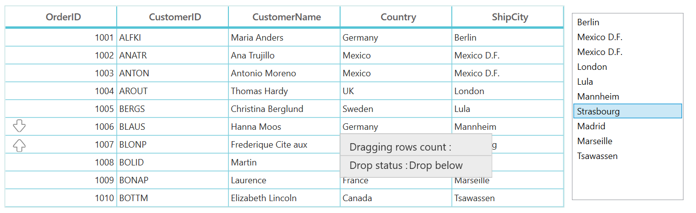
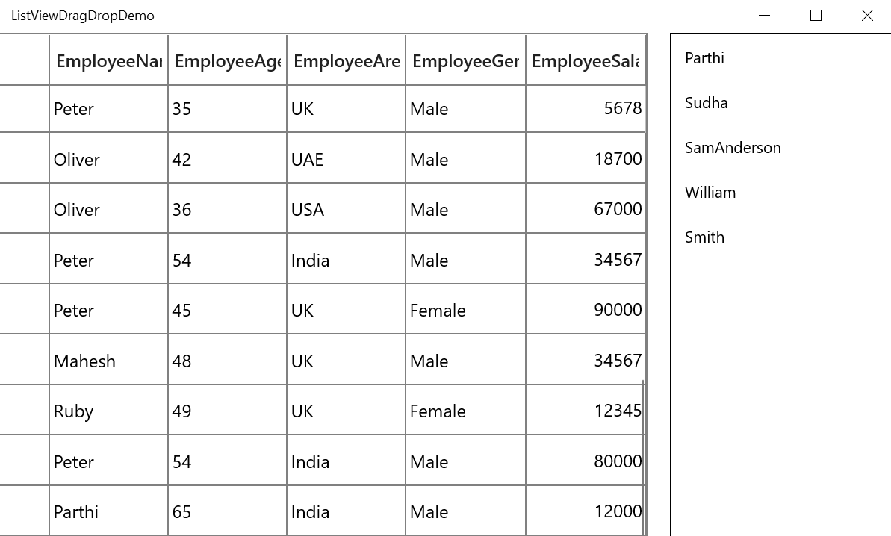

# How to Drag and Drop Rows Between WPF DataGrid and WPF ListView?

This example illustrates how to drag and drop rows between [WPF DataGrid](https://www.syncfusion.com/wpf-controls/datagrid) / [UWP DataGrid](https://www.syncfusion.com/uwp-ui-controls/datagrid) (SfDataGrid) and ListView.

## WPF

To perform dragging between the ListView and DataGrid, by using the [GridRowDragDropController.DragStart](https://help.syncfusion.com/cr/wpf/Syncfusion.UI.Xaml.Grid.GridRowDragDropController.html) and [GridRowDragDropController.Drop](https://help.syncfusion.com/cr/wpf/Syncfusion.UI.Xaml.Grid.GridRowDragDropController.html) events. And you must set the **AllowDrop** property as `true` in the ListView while doing the drag and drop operation from DataGrid with ListView control.

``` c#
this.dataGrid.RowDragDropController.DragStart += sfGrid_DragStart;
this.dataGrid.RowDragDropController.Drop += sfGrid_Drop;
this.listView.PreviewMouseMove += ListView_PreviewMouseMove;
this.listView.Drop += ListView_Drop;

/// <summary>
/// customize the DragStart event.Restrict the certain record from dragging.
/// </summary>
/// <param name="sender"></param>
/// <param name="e"></param>
private void sfGrid_DragStart(object sender, GridRowDragStartEventArgs e)
{
    var draggingRecords = e.DraggingRecords[0] as OrderInfo;
    if (draggingRecords.CustomerName == "Martin")
    {
        e.Handled = true;
    }
}
       
/// <summary>
/// Customize the Drop event.restrict the certain record and Drop position from drop.
/// </summary>
/// <param name="sender"></param>
/// <param name="e"></param>
private void sfGrid_Drop(object sender, GridRowDropEventArgs e)
{
    if (e.IsFromOutSideSource)
    {
        ObservableCollection<object> DraggingRecords = new ObservableCollection<object>();
        if (e.Data.GetDataPresent("ListViewRecords"))
            DraggingRecords = e.Data.GetData("ListViewRecords") as ObservableCollection<object>;
        else
            DraggingRecords = e.Data.GetData("Records") as ObservableCollection<object>;
        var draggingRecords = DraggingRecords[0] as OrderInfo;
        int dropIndex = (int)e.TargetRecord;
        var dropPosition = e.DropPosition.ToString();
        IList collection = AssociatedObject.sfGrid.View.SourceCollection as IList;
        if (dropPosition == "DropAbove")
        {
            dropIndex--;
            collection.Insert(dropIndex, draggingRecords);
        }
        else
        {
            dropIndex++;
            collection.Insert(dropIndex, draggingRecords);
        }
        (AssociatedObject.listView.ItemsSource as ObservableCollection<OrderInfo>).Remove(draggingRecords as OrderInfo);
        e.Handled = true;

    }
}

/// <summary>
/// List view initiates the DragDrop operation
/// </summary>
/// <param name="sender"></param>
/// <param name="e"></param>
private void ListView_PreviewMouseMove(object sender, MouseEventArgs e)
{
    if (e.LeftButton == MouseButtonState.Pressed)
    {
        ListBox dragSource = null;
        var records = new ObservableCollection<object>();
        ListBox parent = (ListBox)sender;
        dragSource = parent;
        object data = GetDataFromListBox(dragSource, e.GetPosition(parent));
        records.Add(data);
        var dataObject = new DataObject();
        dataObject.SetData("ListViewRecords", records);
        dataObject.SetData("ListView", AssociatedObject.listView);

        if (data != null)
        {
            DragDrop.DoDragDrop(parent, dataObject, DragDropEffects.Move);
        }
    }
    e.Handled = true;
}

/// <summary>
/// Get the data from list box control
/// </summary>
/// <param name="source"></param>
/// <param name="point"></param>
/// <returns></returns>
private static object GetDataFromListBox(ListBox source, Point point)
{
    UIElement element = source.InputHitTest(point) as UIElement;
    if (element != null)
    {
        object data = DependencyProperty.UnsetValue;
        while (data == DependencyProperty.UnsetValue)
        {
            data = source.ItemContainerGenerator.ItemFromContainer(element);
            if (data == DependencyProperty.UnsetValue)
            {
                element = VisualTreeHelper.GetParent(element) as UIElement;
            }
            if (element == source)
            {
                return null;
            }
        }
        if (data != DependencyProperty.UnsetValue)
        {
            return data;
        }
    }
    return null;
}

/// <summary>
/// ListView Drop event.
/// </summary>
/// <param name="sender"></param>
/// <param name="e"></param>
private void ListView_Drop(object sender, DragEventArgs e)
{
    ObservableCollection<object> DraggingRecords = new ObservableCollection<object>();
    if (e.Data.GetDataPresent("ListViewRecords"))
    {
        DraggingRecords = e.Data.GetData("ListViewRecords") as ObservableCollection<object>;
        var listViewRecord = DraggingRecords[0] as OrderInfo;
        (AssociatedObject.listView.ItemsSource as ObservableCollection<OrderInfo>).Remove(listViewRecord);
        (this.AssociatedObject.DataContext as ViewModel).OrdersListView.Add(listViewRecord );
    }
    else
    {
        DraggingRecords = e.Data.GetData("Records") as ObservableCollection<object>;    
        var record = DraggingRecords[0] as OrderInfo; 
        this.AssociatedObject.sfGrid.View.Remove(record);
        (this.AssociatedObject.DataContext as ViewModel).OrdersListView.Add(record);        
    }    
}
```



## UWP

To perform dragging between the ListView and SfDataGrid, override the [ProcessOnDragOver](https://help.syncfusion.com/cr/uwp/Syncfusion.UI.Xaml.Grid.GridRowDragDropController.html#Syncfusion_UI_Xaml_Grid_GridRowDragDropController_ProcessOnDragOver_Windows_UI_Xaml_DragEventArgs_Syncfusion_UI_Xaml_ScrollAxis_RowColumnIndex_) and [ProcessOnDrop](https://help.syncfusion.com/cr/uwp/Syncfusion.UI.Xaml.Grid.GridRowDragDropController.html#Syncfusion_UI_Xaml_Grid_GridRowDragDropController_ProcessOnDrop_Windows_UI_Xaml_DragEventArgs_Syncfusion_UI_Xaml_ScrollAxis_RowColumnIndex_) methods in the [GridRowDragDropController](https://help.syncfusion.com/cr/uwp/Syncfusion.UI.Xaml.Grid.GridRowDragDropController.html) class.

``` csharp
this.datagrid.RowDragDropController = new GridRowDragDropControllerExt();

public class GridRowDragDropControllerExt : GridRowDragDropController
{
    ObservableCollection<object> draggingRecords = new ObservableCollection<object>();

    protected override void ProcessOnDragOver(DragEventArgs args, RowColumnIndex rowColumnIndex)
    {
        if (args.DataView.Properties.ContainsKey("DraggedItem"))
            draggingRecords = args.DataView.Properties["DraggedItem"] as ObservableCollection<object>;

        else

            draggingRecords = args.DataView.Properties["Records"] as ObservableCollection<object>;

        if (draggingRecords == null)
            return;

        var dropPosition = GetDropPosition(args, rowColumnIndex, draggingRecords);

        if (dropPosition == DropPosition.None)
        {
            CloseDragIndicators();
            args.AcceptedOperation = DataPackageOperation.None;
            args.DragUIOverride.Caption = "Can't drop here";
            return;
        }

        else if (dropPosition == DropPosition.DropAbove)
        {
            if (draggingRecords != null && draggingRecords.Count > 1)
                args.DragUIOverride.Caption = "Drop these " + draggingRecords.Count + "  rows above";
            else
            {
                args.AcceptedOperation = DataPackageOperation.Copy;

                args.DragUIOverride.IsCaptionVisible = true;
                args.DragUIOverride.IsContentVisible = true;
                args.DragUIOverride.IsGlyphVisible = true;
                args.DragUIOverride.Caption = "Drop above";
            }
        }
          
        else
        {
            if (draggingRecords != null && draggingRecords.Count > 1)
                args.DragUIOverride.Caption = "Drop these " + draggingRecords.Count + "  rows below";
            else
                args.DragUIOverride.Caption = "Drop below";
        }
        args.AcceptedOperation = DataPackageOperation.Move;

        ShowDragIndicators(dropPosition, rowColumnIndex, args);
        args.Handled = true;
    }

    ListView listview;
    protected override void ProcessOnDrop(DragEventArgs args, RowColumnIndex rowColumnIndex)
    {
        listview = null;
            
        if (args.DataView.Properties.ContainsKey("ListView"))
            listview=args.DataView.Properties["ListView"] as ListView;

        if (!DataGrid.SelectionController.CurrentCellManager.CheckValidationAndEndEdit())
            return;

        var dropPosition = GetDropPosition(args, rowColumnIndex, draggingRecords);
        if (dropPosition == DropPosition.None)
            return;

        var droppingRecordIndex = this.DataGrid.ResolveToRecordIndex(rowColumnIndex.RowIndex);

        if (droppingRecordIndex < 0)
            return;

        foreach (var record in draggingRecords)
        {
            if (listview != null)
            {
                (listview.ItemsSource as ObservableCollection<BusinessObjects>).Remove(record as BusinessObjects);
                var sourceCollection = this.DataGrid.View.SourceCollection as IList;

                if (dropPosition == DropPosition.DropBelow)
                    sourceCollection.Insert(droppingRecordIndex + 1, record);
                else
                    sourceCollection.Insert(droppingRecordIndex, record);
            }
            else
            {
                var draggingIndex = this.DataGrid.ResolveToRowIndex(draggingRecords[0]);

                if (draggingIndex < 0)
                {
                    return;
                }

                var recordIndex = this.DataGrid.ResolveToRecordIndex(draggingIndex);
                var recordEntry = this.DataGrid.View.Records[recordIndex];
                this.DataGrid.View.Records.Remove(recordEntry);

                if (draggingIndex < rowColumnIndex.RowIndex && dropPosition == DropPosition.DropAbove)
                    this.DataGrid.View.Records.Insert(droppingRecordIndex - 1, this.DataGrid.View.Records.CreateRecord(record));
                else if (draggingIndex > rowColumnIndex.RowIndex && dropPosition == DropPosition.DropBelow)
                    this.DataGrid.View.Records.Insert(droppingRecordIndex + 1, this.DataGrid.View.Records.CreateRecord(record));
                else
                    this.DataGrid.View.Records.Insert(droppingRecordIndex, this.DataGrid.View.Records.CreateRecord(record));
            }
        }

        CloseDragIndicators();
    }
}
```

For ListView, you can wire the DragEnter, DragItemStarting, DragOver and Drop events.

``` csharp
private void ListView_DragEnter(object sender, DragEventArgs e)
{
    e.AcceptedOperation = Windows.ApplicationModel.DataTransfer.DataPackageOperation.Copy;
}

private void ListView_Drop(object sender, DragEventArgs e)
{
    foreach (var item in records1)
    {
        this.datagrid.View.Remove(item as BusinessObjects);
        (this.DataContext as ViewModel).GDCSource1.Add(item as BusinessObjects);
    }
}

ObservableCollection<object> records1 = new ObservableCollection<object>();
private void ListView_DragOver(object sender, DragEventArgs e)
{
    if (e.DataView.Properties.ContainsKey("Records"))
        records1 = e.DataView.Properties["Records"] as ObservableCollection<object>;
}

private void ListView_DragItemsStarting(object sender, DragItemsStartingEventArgs e)
{
    var records = new ObservableCollection<object>();
    records.Add(listView.SelectedItem);
    e.Data.Properties.Add("DraggedItem", records);
    e.Data.Properties.Add("ListView", listView);
    e.Data.SetText(StandardDataFormats.Text);
}
```

